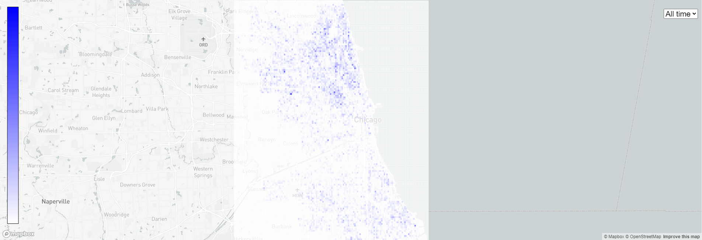
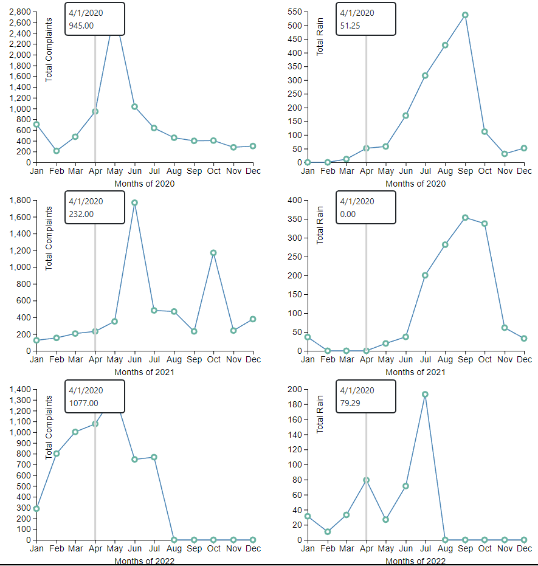

# The repository being analyzed is [311 Service Requests](https://data.cityofchicago.org/Service-Requests/311-Service-Requests/v6vf-nfxy/data)  

## Visualizations can be found [here](https://gmmuller.github.io/)

311 is a service for non-emergency issues and requests. This quote from the website examplifies it: "You can call 311 to find out what Police District and beat you live in, as well as the date, time and location of your next beat meeting. Contacting 311 gives you easy access to non-emergency police services, from filing police reports to talking to police personnel in your district."  

Most request services:  
- Street Light Out
- Garbage Cart Black Maintenance/Replacement
- Rodent Baiting/Rat Complaint
- Tree Trim
- Graffiti Removal
- Pothole in Street
- Abandoned Vehicle Complaint
- Tree Debris
- Alley Light Out
- Sanitation Code Violation

Any person can use the 311 Service Request through a mobile app, phone call or [website]((https://311.chicago.gov/s/faqs?language=en_US)).  

The 311 line is a crowd sourced dataset which means that the data it contains is directly generated by a group of people. The variety of requests in this dataset enables it to be used in different kinds of exploration to answer all sorts of questions.  

The dataset has 7,017,021 rows and 2.28GB. We selected a subset of rows of request type: "Water On Street Complaint", reducing the dataset to 31,963 rows. Therefore, all presented exploration is concerning this type of complaint.

Attributes of interest:  

- `LONGITUDE` and `LATITUDE`: geolocation
- `CREATED_DATE`: timestamp of the request creation. Includes day, month, year, hour, minute and second  
- `SR_TYPE`: type of request 
- `STREET_DIRECTION`: direction of the street: N, S, E, W, SE
- `STREET TYPE`: type of the street: ST (street), AVE (avenue), ...

A [dataset](https://data.cityofchicago.org/Parks-Recreation/Beach-Weather-Stations-Automated-Sensors/k7hf-8y75/data) containing rain information by day was also used:

- `PRECIPITATION`: indicates volume of rain in the last 24h

A [dataset](https://data.cityofchicago.org/Facilities-Geographic-Boundaries/Boundaries-ZIP-Codes/gdcf-axmw) containing zip code boundaries information was also used:

- `ZIP`: zip code
- `BOUNDARY`: the boundaries of the zip code

## Motivation

Urban flooding is a serious phenomenon that can affect the well being of the city's citizens. It can damage public structures, natural structures like trees, private belongings (such as houses and cars), hinder city navigation, cause traffic jams, help spread deseases like leptospirosis and increase the chances of all sorts of accidents. In order to solve this problem it is necessary to investigate the patterns of urban flood, since the phenomenon is heavly associated with how the city is structured. That being said, the 311 dataset was filtered by requests of type: "Water On Street Complaint".  

To help exploring the problem we first formulated 4 domain questions and defined them by creating more specific data questions.

### Question 1

**Domain question:** How are the different regions of the city influenced by flooding?

**Data question:** How is the distribution of "Water On Street Complaint" in the city considering the different years (2018 - 2022)?

**Attributes:** latitude, longitude, number of "Water on Street Complaint" grouped by year, created date

This question can help us understand how urban floods affect different parts of the city, since the structure of the city heavily influences the water flow. Besides that, situations like climate change can make this water flow change and places that were less affected by the rains become more affected and vice versa. Therefore, it is also important to investigating this distributions of rain throughout the years.

The attributes selected are the ones necessary to answer the data question. The "request type" because we want to filter only the requests associated with our problem. "Latitude" and "longitude" because we want to study the distribution. "Created date" because we want to do the comparison over time. 

Given the requirements we created a map and used a heatmap to indicate the distribution of requests. Moreover, a dropdown menu was used to swap between the years and establish quick comparisons.

**Interactions:** Panning, Zooming, Filtering by year

  
  <figcaption align = "center"><b>Plot 1 - Heatmap of "Water On Street Complaint"</b></figcaption>

**Findings:** There is a larger concentration of floods in the north and south of Chicago, specially the north when all the years are considered. This pattern repeats itself throughout all the years. It is difficult to justify these patterns by only looking at the plot. But it is interesting to notice that some regions commonly considered rich areas have the highest amount of complaints. 

**Design Choices:** 

### Question 2

**Domain question:** How much rain is considered a problem by the citizens?

**Data question:** How is the rain precipitation related to the number of "Water On Street Complaint" throughout the last three years?

**Attributes:** created date, rain precipitation, request type (number of requests) 

Flooding is obiviously correlated to the rain precipitation. However, it is important to analyze how sensible is the city (and its citizens) to rain. Besides that, doing this analysis considering multiple years can provide hints on how the city developed, becoming less susceptible to rain, more susceptible or not changing.

The "created date attribute" was selected because we want to do a comparison over time. The rain "precipitation" by day is an attribute that comes from another dataset and indicates the volume of rain in one day. The request type because we want to filter the data by "Water On Street Complaint".

To help answer this questions we created a time series composed of multiple linked views, where each view represents one year. The x axis is the time and the y axis is the number of requests and level of precipitation. Two lines were plotted, one for the requests and another one for the precipitation.

**Interactions:** Linked hovering

  
  <figcaption align = "center"><b>Plot 2 - Linked views comparing Water Complaints and recorded rain Precipitation</b></figcaption>

**Findings:** 2020 has high number of complaints. That can be influenced by COVID-19 and how people spent more at home and had more contact with the problems in their surroundings. Is is important to notice that, despite being correlated, in many months it does not seem to exist a clear casual correlation between rains and complaints. However, overall, there are more complaints in the rainy season. It is interesting to notice that March and April are the months were the snow is melting which can cause some problem as we can see charts. 

### Question 3

**Domain question:** How does the structure of the street influences flooding?

**Data question:** How does street direction and street type influences the amount of "Water On Street Complaint" considering data for the years (2018 - 2022)?

**Attributes:** street direction, number of "Water On Street Complaint" aggregated by street direction and street type, street type

It is important to investigate how the structure of the street influences ocurrency of flooding. Understanding how the structure of the city correlates with flooding can drive the applicatio of interventions that are most likely to succeed.

Street direction indicates an important aspect of the structure of the street as well as street type. The request type is necessary to filter the data to only consider "Water On Street Complaint".

To answer the questions we created a matrix chart (or a calendar chart) where the x axis represents the street direction and the y axis, the street type. The number of requests is then mapped to a color scale and represented by a rectangle.

**Interactions:** Hovering (tooltip)

  
  <figcaption align = "center"><b>Plot 3 - Matrix of street direction by street type</b></figcaption>

**Initial Findings:** Avenues and Streets have more complaints as there are more avenues and street types in Chicago. However, avenues still present more problems than regular streets. It is also interesting to notice that streets facing East have less complaints. Further investigation should be done after normalizing the values considering the street type distribution.

### Question 4

**Domain question:** How are the different neighborhoods in chicago sensitive to flooding?

**Data question:**  How is the distribution of "Water On Street Complaint" in the Zip code level considering data from all years?

**Attributes:** number of "Water On Street Complaint" aggregated by zip code, latitude, longitude

The first question explored how the complaints are distributed over Chicago considering binned data. If we change the aggregation and consider a semantic aggregation (by zip code) we can find patterns not observed before. To aggregate the data another dataset containing zip code boundaries was used.

**Interactions:** Clicking on a zip code updates the matrix chart, showing the correlation between street direction and street type in that region. That allows a general overview and a followed by a more detailed exploration.

  
  <figcaption align = "center"><b>Plot 4 - Distribution of water on street complaints in a zip code level</b></figcaption>

**Initial Findings:** The same pattern observed in Question 1 can be seen on this question but in a much clearer way. The north and south part of the city has much more complaints compared to the rest of it. That give us more confidence to support our primary conclusions.
